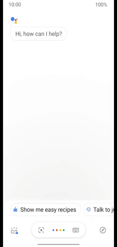
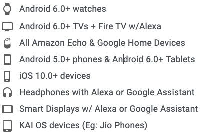

# just-watch-voice
Alexa and GoogleHome Voice 🗣️ App to find WHERE your movies and tv-shows are available for STREAMING 🧐

## ⬇️ Install

- Amazon Alexa/Echo devices - [Download/Enable](https://www.amazon.com/dp/B088FJ7W1M)
- Google Assistant on your Phone/Google Home devices - [Download/Enable](https://assistant.google.com/services/a/uid/0000006c8cbb036a)

P.S : You can fire up Google Assistant app on your phone and say "Talk to Just Watch" to start using this without installing anything. Seriously. Try it NOW!

## ⚛ Features
- Find where to stream your favourite movies and tv shows in an instant. 
- No more logging into each of netflix, Prime Video et al to check where a movie or tv-show is available.
- Search by region. Default region: AU (see instructions below to setup your region)

## 🛠 Setup your location:

- This Action speaks out the results (streaming providers) for a given country at a time. 
- You can also explicitly specify your preferred country for your searches by saying "Set Country" at any time.
- By default, it auto-detects your country based on your device language (en-US for United States, en-GB for United Kingdom and so on)
- For Eg: It can only tell you which streaming providers are offering "The Matrix" in United States at a given time. 
- BUT if your device language is en-US and If you want to know the streaming offers in United Kingdom or Australia (for example), you need to teach the Action your preferred country for searching. Just say "Set Country"

## 🤓 Personalisation Options

- Say "Set Country" to search in a country of your choice. By default, the country is auto detected based on your device language.
- Say "Set Offer Types" to limit search results to one or all of subscription, rental or purchase offers. 
- Say "Set Price Announcement" to teach me if i should announce the actual prices of rental or purchase offers when you search for something. 
- Say "Settings" to hear about all of the available personalisation options.

## ✅ Supported Devices

## 👬 Contribution

- Report issues or suggest features here on Github or Reddit.
- If you feel compelled, I'd love if you spread the word!
- Reach out with any feedback 
- Buy me a beer 

## 💬 Want to know more ?
- Android Police wrote an [article](https://www.androidpolice.com/2020/05/14/you-can-now-talk-to-justwatch-on-google-assistant/) about this skill/action. 
- Some great discussions about this skill/action on [/r/googlehome](https://www.reddit.com/r/googlehome/comments/giye6a/i_made_this_alexa_and_googlehome_voice_app_to/) & [/r/alexa](https://www.reddit.com/r/alexa/comments/giyc1s/i_made_this_alexa_and_googlehome_voice_app_to/)
